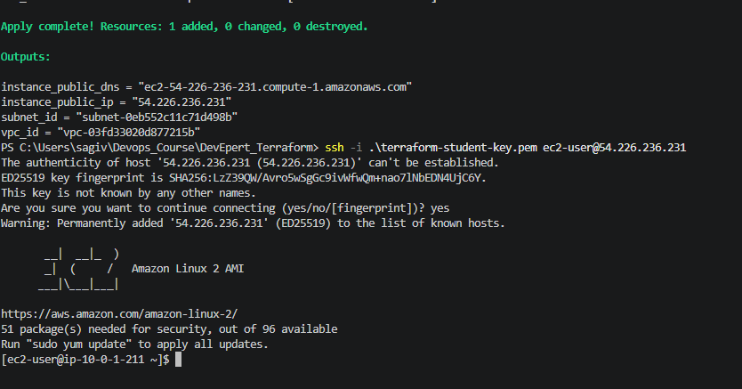
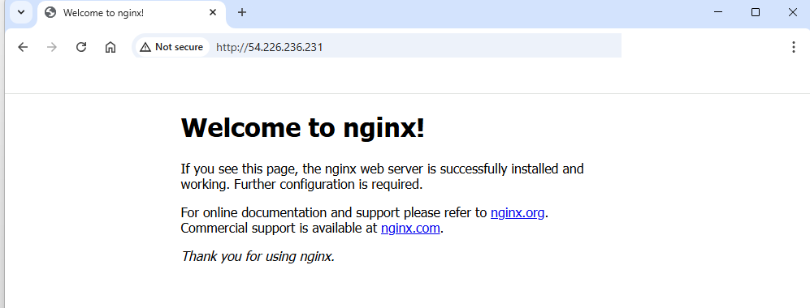
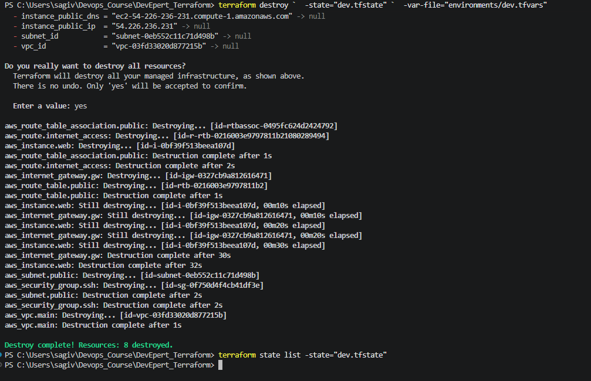

# 🚀 Terraform AWS Environment Project


---

## 📌 Project Overview

This project demonstrates how to use **Terraform** to provision a basic AWS infrastructure environment.

The project was built as part of a DevOps / Terraform learning assignment and focuses on:

- Infrastructure as Code
- AWS Provider configuration
- VPC networking
- Public subnet creation
- Internet access using Internet Gateway and Route Table
- Security Group configuration
- EC2 provisioning
- Environment separation using `.tfvars`
- Separate state files per environment
- SSH access using AWS Key Pair
- Manual nginx installation
- Safe cleanup using `terraform destroy`

---

## 🧱 Architecture

The Terraform configuration creates the following AWS resources:

```text
AWS
└── VPC: 10.0.0.0/16
    └── Public Subnet: 10.0.1.0/24
        └── EC2 Instance
            ├── Public IP enabled
            ├── SSH access on port 22
            └── HTTP access on port 80
```

Internet connectivity is enabled using:

```text
Internet Gateway
Route Table
Route: 0.0.0.0/0
Route Table Association
```

---

## 📁 Project Structure

```text
terraform-project/
├── provider.tf
├── variables.tf
├── networking.tf
├── instances.tf
├── outputs.tf
├── environments/
│   ├── dev.tfvars
│   └── prod.tfvars
├── screenshots/
│   ├── create_env.png
│   ├── nginx_browser.png
│   └── destroy_dev.png
├── .gitignore
├── .terraform.lock.hcl
└── README.md
```

---

## 🧠 Terraform Concepts Demonstrated

| Concept | Description |
|---|---|
| Provider | Connects Terraform to AWS |
| Variables | Allows reusable and flexible infrastructure code |
| tfvars | Supplies different values per environment |
| State | Tracks real infrastructure created by Terraform |
| Separate State Files | Prevents DEV and PROD from colliding |
| Outputs | Displays useful values after apply |
| Resource Dependencies | Terraform understands dependencies through references |
| Security Groups | Controls inbound and outbound traffic |
| Destroy | Safely removes cloud resources to avoid costs |

---

# 📄 File-by-File Explanation

---

## 1. `provider.tf`

### Purpose

This file defines the Terraform provider used by the project.

In this project, the provider is AWS.

```hcl
terraform {
  required_providers {
    aws = {
      source  = "hashicorp/aws"
      version = "~> 6.0"
    }
  }
}

provider "aws" {
  region = var.aws_region
}
```

### Explanation

| Block / Value | Meaning |
|---|---|
| `terraform` | Terraform project-level configuration |
| `required_providers` | Defines which providers Terraform needs |
| `hashicorp/aws` | Official AWS provider by HashiCorp |
| `version = "~> 6.0"` | Uses AWS provider version 6.x |
| `provider "aws"` | Configures AWS as the cloud provider |
| `region = var.aws_region` | Uses a variable instead of hardcoding the AWS region |

### Why use `var.aws_region`?

Using a variable makes the project reusable.

Instead of hardcoding:

```hcl
region = "us-east-1"
```

we use:

```hcl
region = var.aws_region
```

This allows different environments to use different regions if needed.

---

## 2. `variables.tf`

### Purpose

This file defines all variables used by the Terraform project.

```hcl
variable "aws_region" {
  description = "AWS region where resources will be created"
  type        = string
  default     = "us-east-1"
}

variable "environment" {
  description = "Environment name, for example dev or prod"
  type        = string
}

variable "instance_type" {
  description = "EC2 instance type"
  type        = string
}

variable "allowed_ssh_cidr" {
  description = "CIDR block allowed to connect with SSH"
  type        = string
  default     = "0.0.0.0/0"
}

variable "key_name" {
  description = "AWS EC2 Key Pair name used for SSH access"
  type        = string
}
```

### Variable Explanation

| Variable | Example Value | Purpose |
|---|---|---|
| `aws_region` | `us-east-1` | AWS region where resources are created |
| `environment` | `dev` / `prod` | Used for naming and tagging resources |
| `instance_type` | `t3.micro` | Defines the EC2 instance size |
| `allowed_ssh_cidr` | `0.0.0.0/0` | Defines who can connect using SSH |
| `key_name` | `terraform-student-key` | AWS Key Pair used for SSH access |

### Security Note

```hcl
allowed_ssh_cidr = "0.0.0.0/0"
```

This allows SSH access from anywhere.

This is acceptable for a short learning lab, but in real production environments it should be restricted to a trusted IP address, for example:

```hcl
allowed_ssh_cidr = "YOUR_PUBLIC_IP/32"
```

---

## 3. `environments/dev.tfvars`

### Purpose

This file contains values for the Development environment.

```hcl
environment      = "dev"
instance_type    = "t3.micro"
allowed_ssh_cidr = "0.0.0.0/0"
key_name         = "terraform-student-key"
```

### Explanation

| Value | Meaning |
|---|---|
| `environment = "dev"` | Tags and names resources as DEV |
| `instance_type = "t3.micro"` | Uses a Free Tier eligible instance type in this AWS account |
| `allowed_ssh_cidr = "0.0.0.0/0"` | Allows SSH from any IP for lab purposes |
| `key_name = "terraform-student-key"` | Uses the created AWS Key Pair |

---

## 4. `environments/prod.tfvars`

### Purpose

This file contains values for the Production environment.

```hcl
environment      = "prod"
instance_type    = "t3.micro"
allowed_ssh_cidr = "0.0.0.0/0"
key_name         = "terraform-student-key"
```

### Why have a PROD file?

The goal is to demonstrate that the same Terraform code can be reused for multiple environments.

The infrastructure code stays the same, while only the values change.

Example:

```text
dev.tfvars  -> creates DEV resources
prod.tfvars -> creates PROD resources
```

---

## 5. `networking.tf`

### Purpose

This file creates the AWS network layer.

It includes:

- VPC
- Public Subnet
- Internet Gateway
- Route Table
- Internet Route
- Route Table Association

---

### VPC

```hcl
resource "aws_vpc" "main" {
  cidr_block           = "10.0.0.0/16"
  enable_dns_hostnames = true

  tags = {
    Name        = "${var.environment}-vpc"
    Environment = var.environment
    ManagedBy   = "Terraform"
  }
}
```

### Explanation

| Value | Meaning |
|---|---|
| `aws_vpc` | Creates a Virtual Private Cloud |
| `cidr_block = "10.0.0.0/16"` | Defines the private IP range |
| `enable_dns_hostnames = true` | Allows EC2 instances to receive public DNS names |
| `Name = "${var.environment}-vpc"` | Creates names such as `dev-vpc` or `prod-vpc` |
| `ManagedBy = "Terraform"` | Makes it clear that the resource is managed by Terraform |

---

### Public Subnet

```hcl
resource "aws_subnet" "public" {
  vpc_id                  = aws_vpc.main.id
  cidr_block              = "10.0.1.0/24"
  map_public_ip_on_launch = true

  tags = {
    Name        = "${var.environment}-public-subnet"
    Environment = var.environment
    ManagedBy   = "Terraform"
  }
}
```

### Explanation

| Value | Meaning |
|---|---|
| `vpc_id = aws_vpc.main.id` | Places the subnet inside the created VPC |
| `cidr_block = "10.0.1.0/24"` | Defines a smaller network range inside the VPC |
| `map_public_ip_on_launch = true` | Automatically gives EC2 instances a public IP |
| `aws_vpc.main.id` | Demonstrates implicit dependency between resources |

---

### Internet Gateway

```hcl
resource "aws_internet_gateway" "gw" {
  vpc_id = aws_vpc.main.id

  tags = {
    Name        = "${var.environment}-igw"
    Environment = var.environment
    ManagedBy   = "Terraform"
  }
}
```

### Explanation

The Internet Gateway allows the VPC to communicate with the internet.

Without it, the EC2 instance would not be reachable from the browser.

---

### Route Table

```hcl
resource "aws_route_table" "public" {
  vpc_id = aws_vpc.main.id

  tags = {
    Name        = "${var.environment}-public-rt"
    Environment = var.environment
    ManagedBy   = "Terraform"
  }
}
```

### Explanation

A route table controls where network traffic should go.

---

### Internet Route

```hcl
resource "aws_route" "internet_access" {
  route_table_id         = aws_route_table.public.id
  destination_cidr_block = "0.0.0.0/0"
  gateway_id             = aws_internet_gateway.gw.id
}
```

### Explanation

| Value | Meaning |
|---|---|
| `destination_cidr_block = "0.0.0.0/0"` | Represents all internet destinations |
| `gateway_id = aws_internet_gateway.gw.id` | Sends internet traffic through the Internet Gateway |
| `route_table_id` | Adds this route to the public route table |

---

### Route Table Association

```hcl
resource "aws_route_table_association" "public" {
  subnet_id      = aws_subnet.public.id
  route_table_id = aws_route_table.public.id
}
```

### Explanation

This connects the public subnet to the public route table.

Without this association, the subnet would not use the internet route.

---

## 6. `instances.tf`

### Purpose

This file creates:

- Security Group
- EC2 Instance

---

### Security Group

```hcl
resource "aws_security_group" "ssh" {
  name        = "${var.environment}-allow-ssh"
  description = "Allow SSH access"
  vpc_id      = aws_vpc.main.id

  ingress {
    description = "Allow SSH from configured CIDR"
    from_port   = 22
    to_port     = 22
    protocol    = "tcp"
    cidr_blocks = [var.allowed_ssh_cidr]
  }

  ingress {
    description = "Allow HTTP from anywhere for nginx test"
    from_port   = 80
    to_port     = 80
    protocol    = "tcp"
    cidr_blocks = ["0.0.0.0/0"]
  }

  egress {
    description = "Allow all outbound traffic"
    from_port   = 0
    to_port     = 0
    protocol    = "-1"
    cidr_blocks = ["0.0.0.0/0"]
  }

  tags = {
    Name        = "${var.environment}-allow-ssh-http"
    Environment = var.environment
    ManagedBy   = "Terraform"
  }
}
```

### Explanation

| Rule | Port | Purpose |
|---|---:|---|
| SSH | 22 | Allows connection to the server |
| HTTP | 80 | Allows opening nginx in the browser |
| Egress | All | Allows the server to access the internet |

### Important Security Note

Opening SSH to the world is risky:

```hcl
cidr_blocks = ["0.0.0.0/0"]
```

For real-world usage, this should be limited to a specific IP.

---

### EC2 Instance

```hcl
resource "aws_instance" "web" {
  ami                         = "ami-0c02fb55956c7d316"
  instance_type               = var.instance_type
  subnet_id                   = aws_subnet.public.id
  vpc_security_group_ids      = [aws_security_group.ssh.id]
  associate_public_ip_address = true
  key_name                    = var.key_name

  tags = {
    Name        = "${var.environment}-terraform-web-server"
    Environment = var.environment
    ManagedBy   = "Terraform"
  }
}
```

### Explanation

| Value | Meaning |
|---|---|
| `ami` | Amazon Linux 2 image in `us-east-1` |
| `instance_type` | Comes from the environment tfvars file |
| `subnet_id` | Places the EC2 inside the public subnet |
| `vpc_security_group_ids` | Attaches the Security Group |
| `associate_public_ip_address = true` | Gives the instance a public IP |
| `key_name = var.key_name` | Allows SSH using the AWS Key Pair |
| `tags` | Adds clear names and metadata |

---

## 7. `outputs.tf`

### Purpose

This file prints useful information after `terraform apply`.

```hcl
output "instance_public_ip" {
  description = "Public IP address of the EC2 instance"
  value       = aws_instance.web.public_ip
}

output "instance_public_dns" {
  description = "Public DNS name of the EC2 instance"
  value       = aws_instance.web.public_dns
}

output "vpc_id" {
  description = "ID of the created VPC"
  value       = aws_vpc.main.id
}

output "subnet_id" {
  description = "ID of the created public subnet"
  value       = aws_subnet.public.id
}
```

### Output Explanation

| Output | Purpose |
|---|---|
| `instance_public_ip` | Used for SSH and browser access |
| `instance_public_dns` | AWS public DNS name |
| `vpc_id` | Shows the created VPC |
| `subnet_id` | Shows the created subnet |

Example after apply:

```text
instance_public_ip = "54.226.236.231"
```

Then SSH can be used:

```bash
ssh -i ./terraform-student-key.pem ec2-user@54.226.236.231
```

---

## 8. `.gitignore`

### Purpose

This file prevents sensitive or unnecessary files from being pushed to GitHub.

```gitignore
# Terraform local files
.terraform/

# Terraform state files - must not be uploaded to GitHub
*.tfstate
*.tfstate.*

# Terraform plan files
*.tfplan

# Crash logs
crash.log
crash.*.log

# Sensitive files
*.pem
*.key
.env

# VSCode local settings
.vscode/
```

### Important Files Not Uploaded

| File | Reason |
|---|---|
| `.terraform/` | Local provider/plugin cache |
| `*.tfstate` | May contain sensitive infrastructure data |
| `*.pem` | Private SSH key |
| `.env` | May contain secrets |
| `.vscode/` | Local editor settings |

---

## 9. `.terraform.lock.hcl`

### Purpose

This file locks provider versions.

It should be committed to Git.

It ensures that other users who run this project use the same provider version selected during `terraform init`.

Example:

```text
hashicorp/aws v6.44.0
```

---

# 🛠️ Prerequisites

Before using this project, install and configure:

## Required Tools

- Terraform
- AWS CLI
- Git
- VSCode or any code editor
- AWS account
- AWS credentials configured locally

---

## Verify AWS Access

```powershell
aws sts get-caller-identity
```

Expected output:

```json
{
  "UserId": "...",
  "Account": "...",
  "Arn": "..."
}
```

Do not commit or share AWS Access Keys.

---

## Verify Terraform Installation

```powershell
terraform version
```

---

# 🔑 Create AWS EC2 Key Pair

This project uses an AWS Key Pair named:

```text
terraform-student-key
```

Create it before running `terraform apply`.

## PowerShell Command

```powershell
aws ec2 create-key-pair `
  --region us-east-1 `
  --key-name terraform-student-key `
  --query "KeyMaterial" `
  --output text | Out-File -Encoding ascii terraform-student-key.pem
```

## Verify the Key File Exists

```powershell
Test-Path .\terraform-student-key.pem
```

Expected output:

```text
True
```

## Verify the Key Exists in AWS

```powershell
aws ec2 describe-key-pairs `
  --region us-east-1 `
  --query "KeyPairs[*].KeyName" `
  --output table
```

Expected output should include:

```text
terraform-student-key
```

## Security Warning

The file below is a private key:

```text
terraform-student-key.pem
```

Do not upload it to GitHub.

It is ignored by `.gitignore`.

---

# 🚀 How to Run the Project

---

## Step 1 — Initialize Terraform

```powershell
terraform init
```

### What this does

- Downloads the AWS provider
- Creates `.terraform/`
- Creates or updates `.terraform.lock.hcl`
- Prepares the working directory

---

## Step 2 — Format Terraform Files

```powershell
terraform fmt -recursive
```

### What this does

Formats Terraform files consistently.

---

## Step 3 — Validate the Configuration

```powershell
terraform validate
```

Expected output:

```text
Success! The configuration is valid.
```

---

## Step 4 — Plan DEV Environment

```powershell
terraform plan `
  -state="dev.tfstate" `
  -var-file="environments/dev.tfvars"
```

Expected result on a clean deployment:

```text
Plan: 8 to add, 0 to change, 0 to destroy.
```

### Why use `-state="dev.tfstate"`?

This keeps DEV state separate from PROD state.

---

## Step 5 — Apply DEV Environment

```powershell
terraform apply `
  -state="dev.tfstate" `
  -var-file="environments/dev.tfvars"
```

When prompted:

```text
Do you want to perform these actions?
```

Type:

```text
yes
```

Expected result:

```text
Apply complete! Resources: 8 added, 0 changed, 0 destroyed.
```

---

## Step 6 — View Outputs

```powershell
terraform output -state="dev.tfstate"
```

Example output:

```text
instance_public_dns = "ec2-54-226-236-231.compute-1.amazonaws.com"
instance_public_ip  = "54.226.236.231"
subnet_id           = "subnet-..."
vpc_id              = "vpc-..."
```

---

# 🔐 Connect to the EC2 Instance

Use the public IP from the Terraform output.

```powershell
ssh -i .\terraform-student-key.pem ec2-user@<instance_public_ip>
```

Example:

```powershell
ssh -i .\terraform-student-key.pem ec2-user@54.226.236.231
```

If asked:

```text
Are you sure you want to continue connecting?
```

Type:

```text
yes
```

---

# 🌐 Install nginx Manually

After connecting to the EC2 instance, run:

```bash
sudo amazon-linux-extras install nginx1 -y
```

Start nginx:

```bash
sudo systemctl start nginx
```

Enable nginx on boot:

```bash
sudo systemctl enable nginx
```

Check nginx status:

```bash
sudo systemctl status nginx
```

Expected status:

```text
active (running)
```

Test from inside the server:

```bash
curl http://localhost
```

Then open in a browser:

```text
http://<instance_public_ip>
```

Expected result:

```text
Welcome to nginx!
```

---

# 🧪 Evidence / Screenshots

The following screenshots document the full lifecycle of the Terraform deployment:

1. Creating the DEV environment
2. Connecting to the EC2 instance using SSH
3. Installing and testing nginx
4. Destroying all AWS resources to avoid unnecessary costs

---

## ✅ DEV Environment Created Successfully

This screenshot shows:

- `terraform apply` completed successfully
- 8 AWS resources were created
- Terraform outputs were displayed
- SSH connection to the EC2 instance worked successfully



---

## 🌐 nginx Web Server Running

After connecting to the EC2 instance using SSH, nginx was installed manually.

The browser was then opened using the EC2 public IP address, and the default nginx page was displayed successfully.

This proves that:

- The EC2 instance is running
- The Security Group allows HTTP traffic on port 80
- The subnet has internet access
- The route table and Internet Gateway are configured correctly
- nginx is installed and working



---

## 🧹 DEV Environment Destroyed Successfully

This screenshot shows that the DEV environment was destroyed using:

```powershell
terraform destroy `
  -state="dev.tfstate" `
  -var-file="environments/dev.tfvars"
```

The result confirms:

```text
Destroy complete! Resources: 8 destroyed.
```

It also shows that `terraform state list` was executed after the destroy command and no resources were returned, meaning the Terraform-managed infrastructure was successfully removed.



---

## 📸 Screenshot Summary

| Screenshot | Description |
|---|---|
| `screenshots/create_env.png` | Successful Terraform apply, outputs, and SSH connection |
| `screenshots/nginx_browser.png` | nginx web page accessible from browser |
| `screenshots/destroy_dev.png` | Successful Terraform destroy and cleanup verification |

---

# 🏗️ Production Environment

This project also includes a PROD variable file:

```text
environments/prod.tfvars
```

Plan PROD:

```powershell
terraform plan `
  -state="prod.tfstate" `
  -var-file="environments/prod.tfvars"
```

Apply PROD:

```powershell
terraform apply `
  -state="prod.tfstate" `
  -var-file="environments/prod.tfvars"
```

Destroy PROD:

```powershell
terraform destroy `
  -state="prod.tfstate" `
  -var-file="environments/prod.tfvars"
```

---

# ⚠️ State Collision Explanation

Terraform uses state files to track infrastructure.

If both DEV and PROD use the same state file, Terraform may confuse resources between environments.

Bad practice:

```powershell
terraform apply -var-file="environments/dev.tfvars"
terraform apply -var-file="environments/prod.tfvars"
```

This can cause state collision.

Better for this learning project:

```powershell
terraform apply `
  -state="dev.tfstate" `
  -var-file="environments/dev.tfvars"

terraform apply `
  -state="prod.tfstate" `
  -var-file="environments/prod.tfvars"
```

DEV and PROD are tracked separately.

---

# 🧑‍💻 What Was Implemented

## Completed Steps

- Created GitHub repository
- Cloned repository locally
- Built Terraform project structure
- Configured AWS provider
- Created reusable variables
- Added DEV and PROD `.tfvars`
- Created VPC
- Created public subnet
- Created Internet Gateway
- Created route table and internet route
- Associated subnet with route table
- Created Security Group for SSH and HTTP
- Created EC2 instance
- Added SSH Key Pair support
- Enabled public DNS hostnames in the VPC
- Ran `terraform init`
- Ran `terraform validate`
- Ran `terraform plan`
- Ran `terraform apply`
- Connected to EC2 using SSH
- Installed nginx manually
- Verified nginx from browser
- Destroyed all AWS resources
- Verified cleanup using Terraform state

---

# 💰 Cost Awareness

This project was designed to be Free Tier oriented.

Important cost-saving decisions:

- Used `t3.micro`
- Avoided NAT Gateway
- Avoided Load Balancer
- Avoided Elastic IP
- Avoided RDS
- Avoided EKS
- Destroyed resources after testing

Always run:

```powershell
terraform destroy `
  -state="dev.tfstate" `
  -var-file="environments/dev.tfvars"
```

after finishing the test.

---

# 🧠 Engineering Mindset

A professional engineer should ask:

> How can I avoid duplicating infrastructure code?

This project answers that question by using:

- Variables
- Environment-specific `.tfvars` files
- Separate state files
- Reusable Terraform resources
- Tags for environment separation

---

# ✅ Final Result

The project successfully demonstrated:

- Terraform infrastructure provisioning on AWS
- Environment-based configuration
- EC2 deployment
- SSH access
- nginx installation
- Browser access to a web server
- Safe infrastructure cleanup

---

# 📚 Useful Commands Summary

```powershell
terraform init
terraform fmt -recursive
terraform validate
```

DEV:

```powershell
terraform plan `
  -state="dev.tfstate" `
  -var-file="environments/dev.tfvars"

terraform apply `
  -state="dev.tfstate" `
  -var-file="environments/dev.tfvars"

terraform destroy `
  -state="dev.tfstate" `
  -var-file="environments/dev.tfvars"
```

PROD:

```powershell
terraform plan `
  -state="prod.tfstate" `
  -var-file="environments/prod.tfvars"

terraform apply `
  -state="prod.tfstate" `
  -var-file="environments/prod.tfvars"

terraform destroy `
  -state="prod.tfstate" `
  -var-file="environments/prod.tfvars"
```

AWS Key Pair:

```powershell
aws ec2 create-key-pair `
  --region us-east-1 `
  --key-name terraform-student-key `
  --query "KeyMaterial" `
  --output text | Out-File -Encoding ascii terraform-student-key.pem
```

SSH:

```powershell
ssh -i .\terraform-student-key.pem ec2-user@<instance_public_ip>
```

nginx:

```bash
sudo amazon-linux-extras install nginx1 -y
sudo systemctl start nginx
sudo systemctl enable nginx
sudo systemctl status nginx
```

---

## 👤 Author

Created as part of a Terraform AWS DevOps course assignment.

```text
Infrastructure as Code
Terraform
AWS
DevOps
```